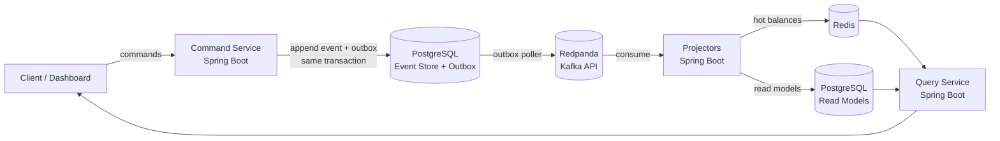

# Reckon

An event-sourced digital wallet ledger. Java 21, Spring Boot, PostgreSQL, Redpanda, Redis.

Every balance change is an immutable event. Balances are never stored and edited — they're
derived by replaying the event log. That one choice buys a complete audit trail, the
ability to reconstruct any balance at any point in time, and read models that can be
dropped and rebuilt from the source of truth.

> **Status:** in development. The event store and the write-side foundation are in place;
> projections, the query service, and the dashboard are not yet built. See
> [Roadmap](#roadmap).

## Why event sourcing

The conventional design gives an account a `balance` column and `UPDATE`s it. Deposit
$50 and it moves 100 → 150 — and the previous value is gone. When a balance turns out to
be wrong, the evidence of how it got that way was overwritten by the bug that caused it.

Reckon stores the facts instead:

```
AccountOpened(owner=abhishek, currency=USD)
MoneyDeposited(amountMinor=5000)
MoneyWithdrawn(amountMinor=2000)
```

The balance is 3000 because those three things happened, and the log proves it. State is
a fold over history, not a cell to be overwritten.

The trade-offs are real and worth stating plainly. Reads cost more as the log grows,
which is what snapshots address. The read side is eventually consistent, so projection
lag becomes a health signal you have to monitor. Event schemas are append-only forever,
because history must stay readable. This design earns its keep in ledgers and audit-heavy
domains; it would be a poor fit for CRUD.

## Architecture



**Write side** — the source of truth. A command is validated against an aggregate
rehydrated from its events, then appended under optimistic concurrency. The event and its
outbox row are written in a single transaction, so publishing can never disagree with the
log.

**Read side** — eventually consistent. Projectors consume events and maintain read models
shaped for querying: durable history in Postgres, hot balances in Redis. Both are
disposable and rebuildable from the event store.

The two sides are separated because they have genuinely different jobs. Writes need
invariants and concurrency control; reads need denormalised shapes and speed. CQRS lets
each be modelled for its own problem instead of compromising on one schema.

## The event store

One append-only table. The design is in
[`V1__create_events_table.sql`](command-service/src/main/resources/db/migration/V1__create_events_table.sql),
and this is the line that carries the system:

```sql
CONSTRAINT events_aggregate_version_unique UNIQUE (aggregate_id, version)
```

That constraint is the concurrency control. To append, a command must claim the
aggregate's next version. Two concurrent withdrawals both replay the account to version 7
and both attempt to write version 8 — Postgres accepts exactly one. The loser retries
against current state, where it may correctly be rejected for insufficient funds. No
locks, no `SELECT FOR UPDATE`, no lost updates, no double-spend.

`UPDATE` and `DELETE` on `events` are rejected by a trigger. An audit trail that can be
quietly rewritten is not an audit trail, and rebuild-from-log only holds if history is
immutable. The consequence is deliberate: a wrong event is never corrected in place, it
is compensated by appending an event that reverses it — the same discipline a ledger has
always used, where you void a bad entry with a balancing one rather than an eraser.

Amounts are integer minor units (cents) in `BIGINT`, never floating point. `0.1 + 0.2`
is `0.30000000000000004` in binary floating point, and rounding drift across a ledger is
an audit failure.

## Running it

Requires Docker and JDK 21.

```bash
docker compose up -d --wait          # PostgreSQL, Redpanda, Redis
cd command-service && ./gradlew bootRun
```

Verify the service is connected to the event store:

```bash
curl -s localhost:8080/actuator/health | jq '.components.db'
```

Inspect the schema:

```bash
docker compose exec postgres psql -U reckon -d reckon -c '\d events'
```

### Ports

| Service | Host | In-network |
|---|---|---|
| PostgreSQL | 5433 | `postgres:5432` |
| Redpanda (Kafka API) | 19092 | `redpanda:9092` |
| Redis | 6379 | `redis:6379` |
| command-service | 8080 | — |

Postgres is mapped to 5433 to avoid colliding with a local PostgreSQL on the default
port. Override any connection setting via `RECKON_DB_URL`, `RECKON_DB_USER`, and
`RECKON_DB_PASSWORD`.

## Layout

```
reckon/
├── docker-compose.yml       # PostgreSQL + Redpanda + Redis
└── command-service/         # write side: commands, event store
    └── src/main/
        ├── java/dev/reckon/command/
        │   └── domain/account/    # Account commands and events
        └── resources/db/migration/  # event store schema
```

Each service is an independent Gradle build. They share event *contracts*, never a
database — a service that reaches into another's tables is not a separate service.

## Roadmap

- [x] Event store with optimistic concurrency
- [x] Account command and event contracts
- [ ] Account aggregate — rehydration, invariants, append
- [ ] Transactional outbox → Redpanda
- [ ] Projections and read models
- [ ] Query service with Redis hot reads
- [ ] Transfers as a saga with compensation
- [ ] Command idempotency
- [ ] Aggregate snapshots
- [ ] Dashboard with event-log / replay viewer
- [ ] Metrics: throughput, projection lag, saga outcomes
- [ ] Read-model rebuild from the log
